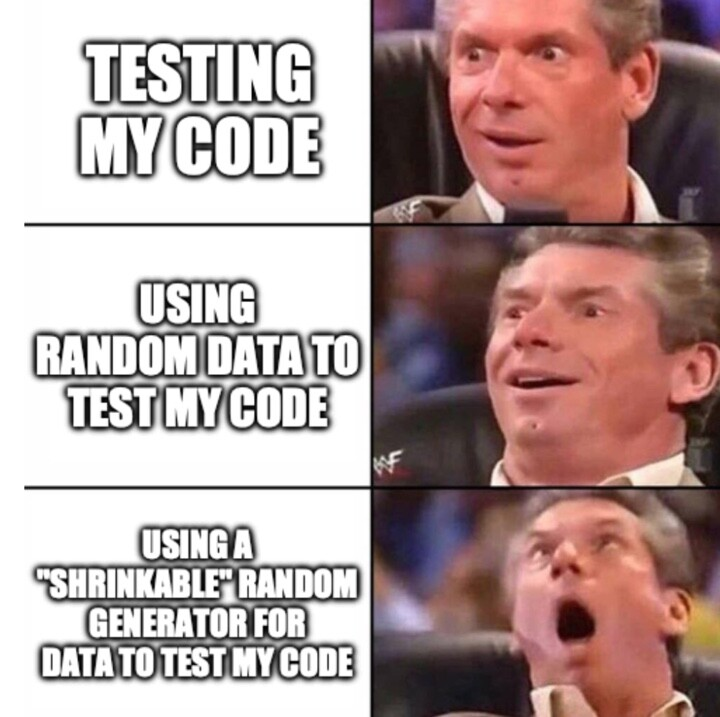

# Property-Based Testing

1. intro - what property tesing does
    1. **there and back** - deserializing the output of a serialzier
    2. & 3: test examples require imagination to be thorough

2. some mathematical properties for pure functions
    1. **idempotent**: `f(a) = f(f(a))`
        - repeated calls have no further effect
    2. **involutive**: `a = f(f(a))`
        - repeated calls reverse the effect
    3. **commutative**: `a + b = b + a`
        - order of arguments doesn't matter
    4. **distributive**: `f(a+b) = f(a) + f(b)`
        - order of operations doesn't matter
    5. **associative**: `a + (b + c) = (a + b) + c`
        - grouping doesn't matter
        - generally applies to any concatenation-type operation
    6. **identity operations** `f(a,b) = a where a = 1`
        - there's a special argument that makes the operation return the other argument
    7. **zeroing operations** `f(a,b) = b where a = 0`
        - there's a special argument that makes the operation return the special argument
    8. **injective operations** `f(x) = z & f(y) = z ∴ x = y`
    9. **bijective operations**
        - all inputs map to exactly one output, and vise versa; operation is therefore reversible
        - reverse
        - push/pop, shift/unshift
        - serializers/deserializers, encoders/decoders

3. mindset, other ideas for application
    1. mindsets
        Easier:
        - things "mathy" in nature
        - "pure" operations with no side-effects

        Medium:
        - things involving state / dependednt operations
        - things with complex inputs/outputs
        - side effects that are deterministic

        Harder:
        - things with opaque state
        - non-deterministic side-effects

        Notes:
        - triangle inequality: https://en.wikipedia.org/wiki/Triangle_inequality
        - what are the boundaries of the thing I'm testing?
        - what does the thing I'm testing actually _do_?
        - Matthew's Three Types of Bugs
            1. it doesn't do what it's supposed to
            2. it does what it's supposed to do, but what it's supposed to do is wrong
            3. we don't like what it's doing, but we're not sure what it's supposed to be doing either
    2. equivalent / reference implementations
        - various sorting algorithms
        - query engines:
            - generating data for the database, variables for query
            - parallel implement query operation in code (which is presumably more readable/predictable)
            - does the database query results equal the code results
    3. state machines
        - generate sequences of operations
    4. race conditions
        - generate sequences of operations over time, validate nothing bad happens
    5. UI fuzzing
        - https://medium.com/criteo-engineering/detecting-the-unexpected-in-web-ui-fuzzing-1f3822c8a3a5
    6. random data for fuzzing
    7. random data for demos
    8. abuse them as solvers
        - water pouring puzzle: https://en.wikipedia.org/wiki/Water_pouring_puzzle
         (prettier example of this for Python's Hypothesis: https://hypothesis.works/articles/how-not-to-die-hard-with-hypothesis/ )

4. generating values
    This part is tedious, varies highly from library to library

    in general, you are building a Rose tree: https://en.wikipedia.org/wiki/Rose_tree
        each branch / leaf has a notion of magnitude, and can be "shrunk" or removed

    I suggest composing from primitives and mapping/filtering them into "subtypes"

5. some language libraries:
    - the OG QuickCheck: https://hackage.haskell.org/package/QuickCheck
    - JavaScript & variants: FastCheck https://fast-check.dev
    - Clojure (where I was introduced to it): https://github.com/clojure/test.check
    - .NET: FsCheck https://fscheck.github.io/FsCheck/
    - Go: Rapid https://github.com/flyingmutant/rapid
    - Java: Junit-Quickcheck https://github.com/pholser/junit-quickcheck
    - Python: Hypothesis https://hypothesis.works
    - Erlang: Proper https://github.com/proper-testing/proper
    - Swift: SwiftCheck https://github.com/typelift/SwiftCheck
    - Ruby: Rantly https://github.com/rantly-rb/rantly

    and so many more: https://github.com/topics/quickcheck
